Visualizing ImageNet Features and Filters
=========================================

[View this page as an IPython Notebook](http://nbviewer.ipython.org/github/BVLC/caffe/blob/master/examples/filter_visualization/lena_imagenet.ipynb)

---

Here we visualize filters and outputs using the network architecture proposed by
Krizhevsky et al. for ImageNet and implemented in `caffe`.

(This page follows the DeCAF visualizations originally by Yangqing Jia.)

First, import required modules and set plotting parameters

    import numpy as np
    import matplotlib.pyplot as plt
    %matplotlib inline
    
    # normally this file is located in caffe/examples/filter_visualization
    caffe_root = '../../'
    import sys
    sys.path.insert(0, caffe_root + 'python')
    
    import caffe
    import caffe.imagenet
    
    plt.rcParams['figure.figsize'] = (10, 10)
    plt.rcParams['image.interpolation'] = 'nearest'
    plt.rcParams['image.cmap'] = 'gray'

Load the net and specify test phase (since we are doing classification) and CPU
mode

    net = caffe.imagenet.ImageNetClassifier(caffe_root + 'models/imagenet.prototxt',
                                            caffe_root + 'models/caffe_reference_imagenet_model')
    net.caffenet.set_phase_test()
    net.caffenet.set_mode_cpu()

Run a classification pass

    scores = net.predict(caffe_root + 'examples/filter_visualization/lena.png')

The layer features and their shapes (10 is the batch size, corresponding to the
the ten subcrops used by Krizhevsky et al.)

    [(k, v.data.shape) for k, v in net.caffenet.blobs.items()]

    [('data', (10, 3, 227, 227)),
     ('conv1', (10, 96, 55, 55)),
     ('pool1', (10, 96, 27, 27)),
     ('norm1', (10, 96, 27, 27)),
     ('conv2', (10, 256, 27, 27)),
     ('pool2', (10, 256, 13, 13)),
     ('norm2', (10, 256, 13, 13)),
     ('conv3', (10, 384, 13, 13)),
     ('conv4', (10, 384, 13, 13)),
     ('conv5', (10, 256, 13, 13)),
     ('pool5', (10, 256, 6, 6)),
     ('fc6', (10, 4096, 1, 1)),
     ('fc7', (10, 4096, 1, 1)),
     ('fc8', (10, 1000, 1, 1)),
     ('prob', (10, 1000, 1, 1))]

The parameters and their shapes (each of these layers also has biases which are
omitted here)

    [(k, v[0].data.shape) for k, v in net.caffenet.params.items()]

    [('conv1', (96, 3, 11, 11)),
     ('conv2', (256, 48, 5, 5)),
     ('conv3', (384, 256, 3, 3)),
     ('conv4', (384, 192, 3, 3)),
     ('conv5', (256, 192, 3, 3)),
     ('fc6', (1, 1, 4096, 9216)),
     ('fc7', (1, 1, 4096, 4096)),
     ('fc8', (1, 1, 1000, 4096))]

Helper functions for visualization

    # our network takes BGR images, so we need to switch color channels
    def showimage(im):
        if im.ndim == 3:
            im = im[:, :, ::-1]
        plt.imshow(im)
        
    # take an array of shape (n, height, width) or (n, height, width, channels)
    #  and visualize each (height, width) thing in a grid of size approx. sqrt(n) by sqrt(n)
    def vis_square(data, padsize=1, padval=0):
        data -= data.min()
        data /= data.max()
        
        # force the number of filters to be square
        n = int(np.ceil(np.sqrt(data.shape[0])))
        padding = ((0, n ** 2 - data.shape[0]), (0, padsize), (0, padsize)) + ((0, 0),) * (data.ndim - 3)
        data = np.pad(data, padding, mode='constant', constant_values=(padval, padval))
        
        # tile the filters into an image
        data = data.reshape((n, n) + data.shape[1:]).transpose((0, 2, 1, 3) + tuple(range(4, data.ndim + 1)))
        data = data.reshape((n * data.shape[1], n * data.shape[3]) + data.shape[4:])
        
        showimage(data)

The input image

    # index four is the center crop
    image = net.caffenet.blobs['data'].data[4].copy()
    image -= image.min()
    image /= image.max()
    showimage(image.transpose(1, 2, 0))

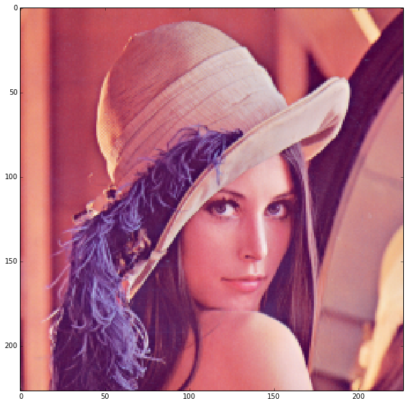

The first layer filters, `conv1`

    # the parameters are a list of [weights, biases]
    filters = net.caffenet.params['conv1'][0].data
    vis_square(filters.transpose(0, 2, 3, 1))

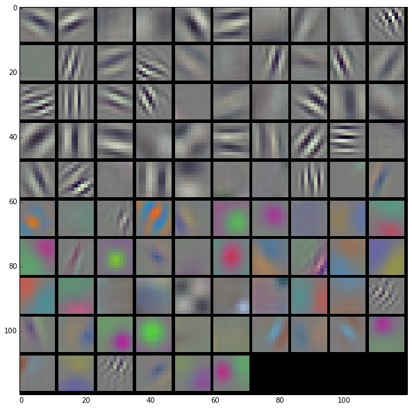

The first layer output, `conv1` (rectified responses of the filters above, first
36 only)

    feat = net.caffenet.blobs['conv1'].data[4, :36]
    vis_square(feat, padval=1)

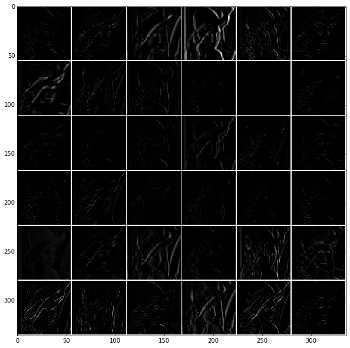

The second layer filters, `conv2`

There are 128 filters, each of which has dimension 5 x 5 x 48. We show only the
first 48 filters, with each channel shown separately, so that each filter is a
row.

    filters = net.caffenet.params['conv2'][0].data
    vis_square(filters[:48].reshape(48**2, 5, 5))

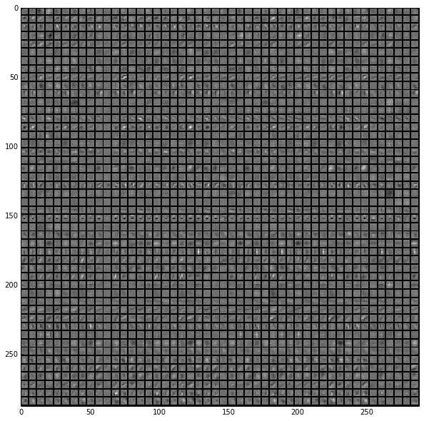

The second layer output, `conv2` (rectified, only the first 36 of 256 channels)

    feat = net.caffenet.blobs['conv2'].data[4, :36]
    vis_square(feat, padval=1)

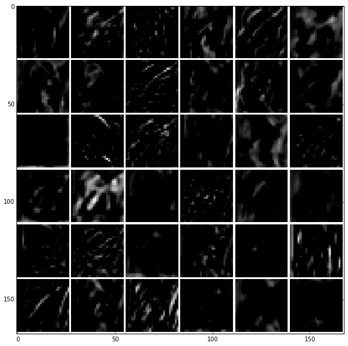

The third layer output, `conv3` (rectified, all 384 channels)

    feat = net.caffenet.blobs['conv3'].data[4]
    vis_square(feat, padval=0.5)

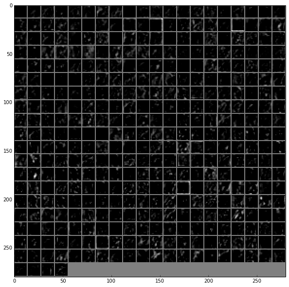

The fourth layer output, `conv4` (rectified, all 384 channels)

    feat = net.caffenet.blobs['conv4'].data[4]
    vis_square(feat, padval=0.5)

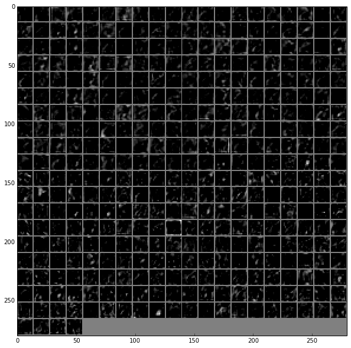

The fifth layer output, `conv5` (rectified, all 256 channels)

    feat = net.caffenet.blobs['conv5'].data[4]
    vis_square(feat, padval=0.5)

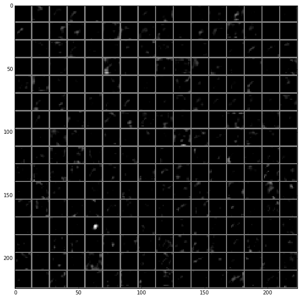

The fifth layer after pooling, `pool5`

    feat = net.caffenet.blobs['pool5'].data[4]
    vis_square(feat, padval=1)

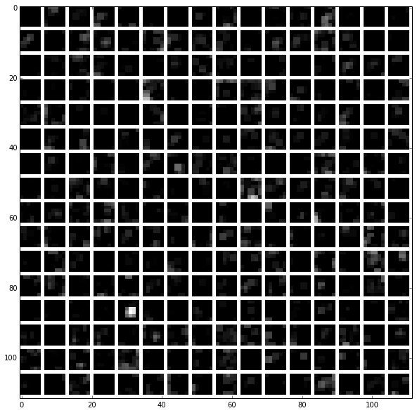

The first fully connected layer, `fc6` (rectified)

We show the output values and the histogram of the positive values

    feat = net.caffenet.blobs['fc6'].data[4]
    plt.subplot(2, 1, 1)
    plt.plot(feat.flat)
    plt.subplot(2, 1, 2)
    _ = plt.hist(feat.flat[feat.flat > 0], bins=100)

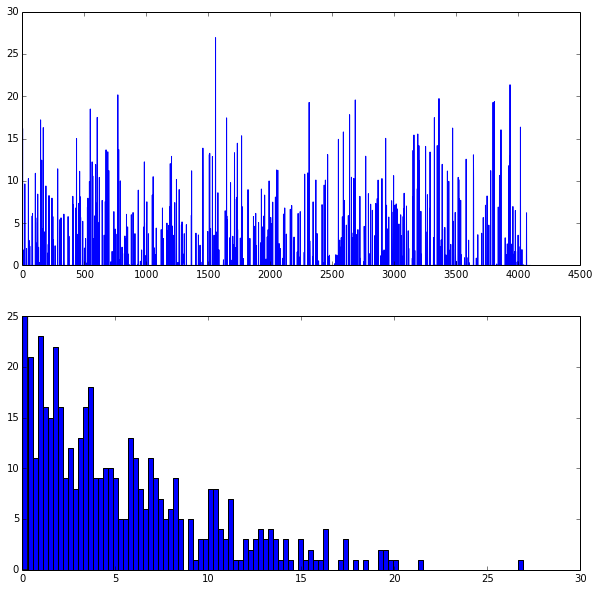

The second fully connected layer, `fc7` (rectified)

    feat = net.caffenet.blobs['fc7'].data[4]
    plt.subplot(2, 1, 1)
    plt.plot(feat.flat)
    plt.subplot(2, 1, 2)
    _ = plt.hist(feat.flat[feat.flat > 0], bins=100)

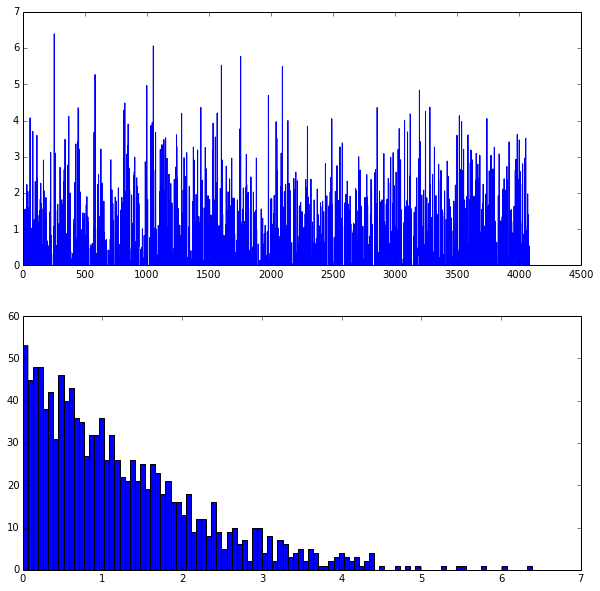

The final probability output, `prob`

    feat = net.caffenet.blobs['prob'].data[4]
    plt.plot(feat.flat)

    [<matplotlib.lines.Line2D at 0x9a24190>]

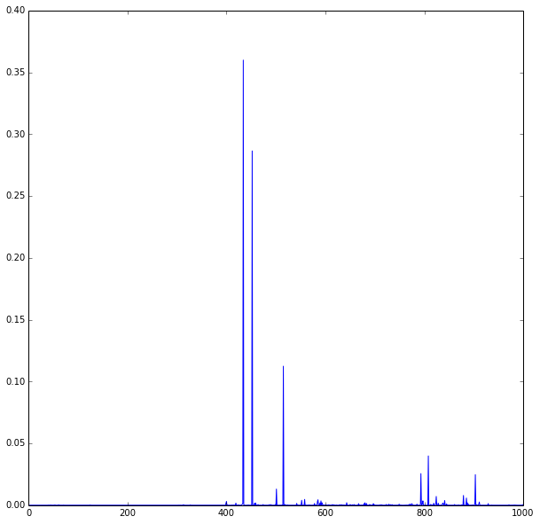

And the top 5 predicted labels

    labels = np.loadtxt(caffe_root + 'data/ilsvrc12/synset_words.txt', str, delimiter='\t')

    top_k = net.caffenet.blobs['prob'].data[4].flatten().argsort()[-1:-6:-1]
    print labels[top_k]

    ['n02808304 bath towel' 'n02869837 bonnet, poke bonnet'
     'n03124170 cowboy hat, ten-gallon hat' 'n04259630 sombrero'
     'n04209133 shower cap']

