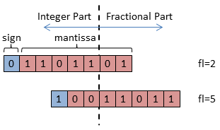
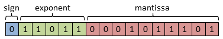

#Approximation Strategies

This section covers 3 different strategies to quantize 32-bit floating point networks.

##Dynamic Fixed Point
The different parts of a CNN have a significant dynamic range. In large layers, the outputs are the result of thousands of accumulations, thus the network parameters are much smaller than the layer outputs. Fixed point only has limited capability to cover a wide dynamic range. Dynamic fixed point as proposed by Courbariaux et al. [1] can be a good solution to overcome this problem. In dynamic fixed point, each number *n* is represented as follows:

$$n=(-1)^s 2^{fl} \sum_{i=0}^{B-2} 2^i x_i$$

Here *B* donates the bit-width, *s* the sign bit, *fl* is the fractional length, and *x* the mantissa bits. Since the intermediate values in a network have different ranges, it is desirable to group fixed point numbers into groups with constant *fl*. So the number of bits allocated to the fractional part is constant within that group, but different compared to other groups. Each network layer is split into two groups: one for the layer outputs, one for the layer weights. This allows to better cover the dynamic range of both layer outputs and weights, as weights are normally significantly smaller.

[1] Matthieu Courbariaux, Yoshua Bengio, and Jean-Pierre David. [Low precision arithmetic for deep learning](http://arxiv.org/abs/1412.7024). arXiv preprint, 2014.

##Mini Floating Point

Since the training of neural networks is done in floating point, it is an intuitive approach condense these models to bit-width reduced floating point numbers. In order to condense networks and reduce their computational and memory requirements, Ristretto can represent floating point numbers with much fewer bits than the IEEE-754
standard. We follow the standard to a large degree when going to 16bit, 8bit or even
smaller numbers, but our format differs in some details. Namely, the exponent bias is
lowered according to the number of bits assigned to the exponent:

$$bias=2^{exp_bits-1}-1$$

Here *exp_bits* donates the number of bits assigned to the exponent. Another difference to
the IEEE standard is that we don't support denormalized numbers, INF and NaN. INF is
replaced by saturated numbers, and denormalized numbers are replace by 0. Finally, the
number of bits assigned to the exponent and mantissa part don't follow a specific rule. To
be more precise, Ristretto chooses the exponent bits such that no saturation occurs.

##Power-of-two parameters

Hardware accelerators for convolutional neural networks need to be energy-efficient to
allow for deployment in mobile devices. Fully connected layers and convolutional layers
consist of additions and multiplications, where multipliers require a much larger chip
area. This motivated previous research to eliminate all multipliers by using power-of-two
weights [1]. These weights can be considered as mini floating point numbers with zero
mantissa bits. Multiplications between weights and layer activations turn into bit-shifts. Power-of-two parameters can be written as follows:

$$n=(-1)^s 2^exp$$

Here *exp* is an integer, typically negative for network parameters. Since small parameters close to zero don't have much effect on the networks output, very small exponents can be ignored. Thus the possible exponent values can be significantly reduced:

$$exp \in [exp_min .. exp_max]$$

[1] Tang, Chuan Zhang, and Hon Keung Kwan. [Multilayer feedforward neural
networks with single powers-of-two weights](http://ieeexplore.ieee.org/xpl/abstractAuthors.jsp?arnumber=229903). Signal Processing, IEEE Transactions on
41.8 (1993).
