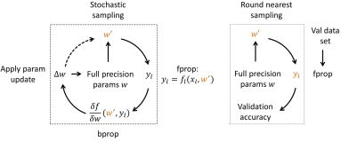

#Ristretto Layers, Testing and Training

This modified caffe version supports layers with limited numerical precision. The layers in question use limited precision numbers for layer parameters and layer outputs. As Ristretto follows the principles of Caffe, users already aquinted with Caffe will understand Ristretto quickly. The main additions that Ristretto introduces are explained below.

##Ristretto Layers

Ristretto introduces new layer types with limited numerical precision. These layers can be used through the traditional Caffe net description files (*.prototxt).

An example of a *mini floating point* convolutional layer is given below:
```
layer {
  name: "conv1"
  type: "ConvolutionRistretto"
  bottom: "data"
  top: "conv1"
  convolution_param {
    num_output: 96
    kernel_size: 7
    stride: 2
    weight_filler {
      type: "xavier"
    }
  }
  quantization_param {
    precision: MINI_FLOATING_POINT
    mant_bits: 10
    exp_bits: 5
  }
}
```

This layer will use half precision (16-bit floating point) number representation. The convolution kernels, bias as well as layer outputs are trimmed to this format.

Notice the three differences to a traditional convolutional layer:
* `type` changes to `ConvolutionRistretto`
* An additional layer parameter is added: `quantization_param`
* This layer parameter contains all the information used for quantization

Ristretto provides limited precision layers at src/caffe/ristretto/layers/.

##Blobs

Ristretto allows for accurate simulation of resource-limited hardware accelerators. In order to stay with the Caffe principles, Ristretto reuses floating point blobs for layer parameters and outputs. This means that all numbers with limited precision are actually stored in floating point blobs.

##Scoring

For scoring of quantized networks, Ristretto requires

* The network parameters
* The network definition with limited precision layers

The first item is the result of the traditional training in Caffe. Ristretto can test networks using full-precision parameters. The parameters are converted to limited precision on the fly, using round-nearest scheme by default.

As for the second item, the model description, you will either have to manually change Caffe-layers to Ristretto-layers, or use the Ristretto [tool](Ristretto_Tool.md) for automatic generation of a Google Protocol Buffer file.
```
# score the dynamic fixed point SqueezeNet model on the validation set
./build/tools/caffe test --model=models/SqueezeNet/demo/quantized.prototxt \
	--weights=models/SqueezeNet/demo/squeezenet_finetuned.caffemodel \
	--gpu=0 --iterations=2000
```

##Fine-tuning

In order to improve a condensed network's accuracy, it should always be fine-tuned. In Risretto, the *caffe* command line tool supports fine-tuning of condensed networks. The only  difference to traditional training is that the network description file should contain Ristretto layers.

The following items are required for fine-tuning:

* The network parameters
* Solver with hyper parameters for training

The network parameters are the result of full-precision training in Caffe.

The solver contains the path to the condensed network description. This network description is the same one that we used for scoring.
```
# fine-tune dynamic fixed point SqueezeNet
./build/tools/caffe train \
	--solver=models/SqueezeNet/demo/solver_finetune.prototxt \
	--weights=models/SqueezeNet/squeezenet_v1.0.caffemodel
```

###Implementation details

During this retraining procedure, the network learns how to classifiy images with fixed point parameters. Since the network weights can only have discrete values, the main challenge consists in the weight update. We adopt the idea of previous work (Courbariaux et al. [1]) which uses full precision shadow weights. Small weight updates are applied to the full precision weights w, whereas the discrete weights w' are sampled from the full precision weights. The sampling during fine-tuning is done with stochastic rounding, which was successfully used by Gupta et al. [2] to train networks in 16-bit fixed point.



[1] Matthieu Courbariaux, Yoshua Bengio, and Jean-Pierre David. [Binaryconnect: Training deep neural networks with binary weights during propagations](http://papers.nips.cc/paper/5647-shape-and-illumination-from-shading-using-the-generic-viewpoint-assumption). In Advances in Neural Information Processing Systems, 2015.

[2] Suyog Gupta, Ankur Agrawal, Kailash Gopalakrishnan, and Pritish Narayanan. [Deep learning with limited numerical precision](http://arxiv.org/abs/1502.02551). arXiv preprint, 2015.

