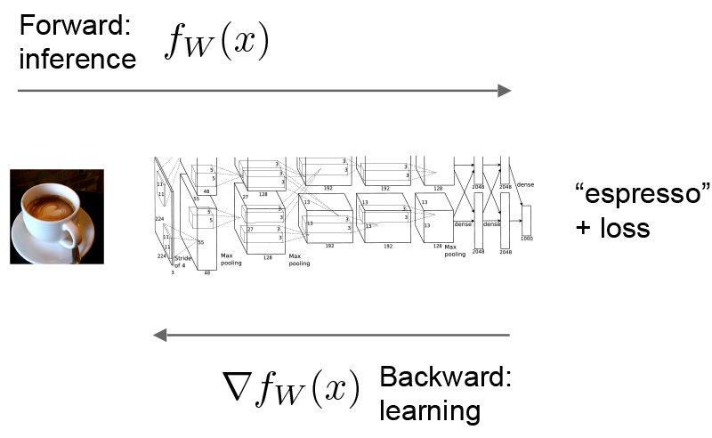
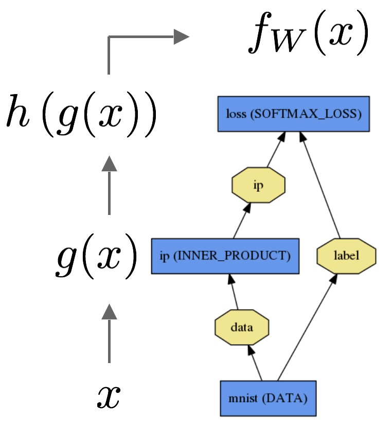
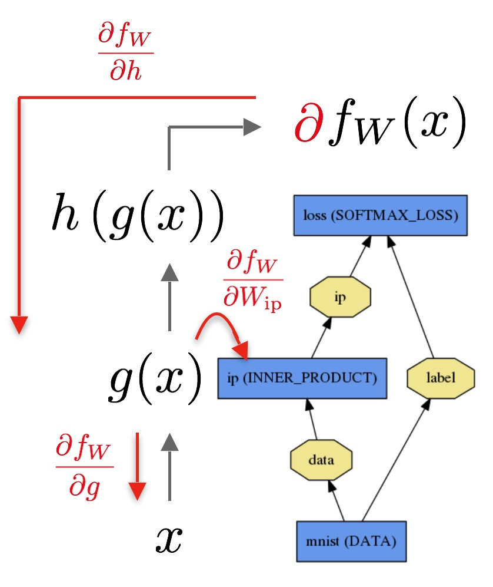

# Forward and Backward

The forward and backward passes are the essential computations of a [Net](net_layer_blob.html).

Let's consider a simple logistic regression classifier.

The **forward** pass computes the output given the input for inference.
In forward Caffe composes the computation of each layer to compute the "function" represented by the model.
This pass goes from bottom to top.

The data $$x$$ is passed through an inner product layer for $$g(x)$$ then through a softmax for $$h(g(x))$$ and softmax loss to give $$f_W(x)$$.

The **backward** pass computes the gradient given the loss for learning.
In backward Caffe reverse-composes the gradient of each layer to compute the gradient of the whole model by automatic differentiation.
This is back-propagation.
This pass goes from top to bottom.

The backward pass begins with the loss and computes the gradient with respect to the output $$\frac{\partial f_W}{\partial h}$$. The gradient with respect to the rest of the model is computed layer-by-layer through the chain rule. Layers with parameters, like the `INNER_PRODUCT` layer, compute the gradient with respect to their parameters $$\frac{\partial f_W}{\partial W_{\text{ip}}}$$ during the backward step.

These computations follow immediately from defining the model: Caffe plans and carries out the forward and backward passes for you.

- The `Net::Forward()` and `Net::Backward()` methods carry out the respective passes while `Layer::Forward()` and `Layer::Backward()` compute each step.
- Every layer type has `forward_{cpu,gpu}()` and `backward_{cpu,gpu}()` methods to compute its steps according to the mode of computation. A layer may only implement CPU or GPU mode due to constraints or convenience.

The [Solver](solver.html) optimizes a model by first calling forward to yield the output and loss, then calling backward to generate the gradient of the model, and then incorporating the gradient into a weight update that attempts to minimize the loss. Division of labor between the Solver, Net, and Layer keep Caffe modular and open to development.

For the details of the forward and backward steps of Caffe's layer types, refer to the [layer catalogue](layers.html).

