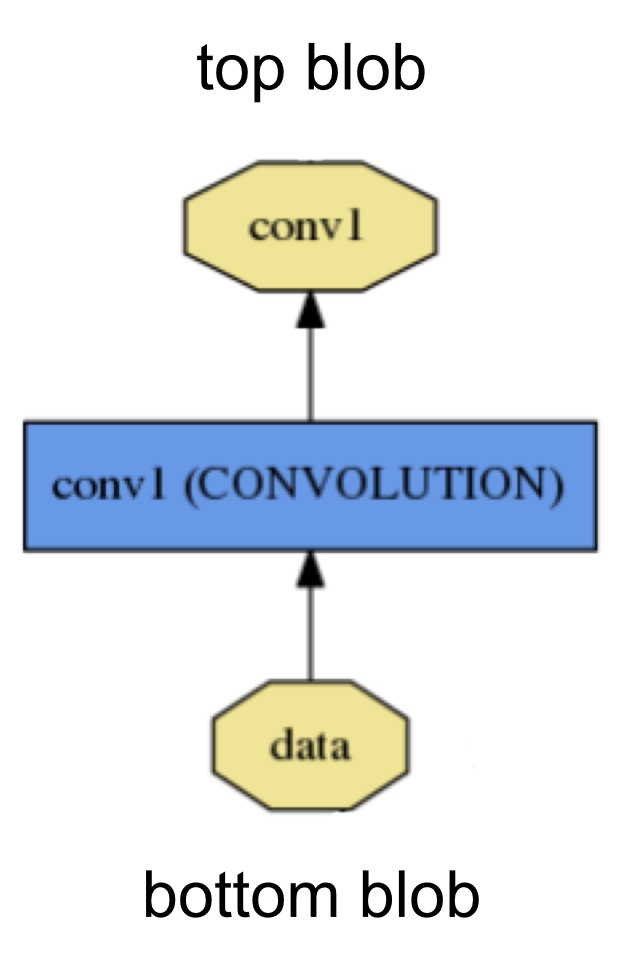
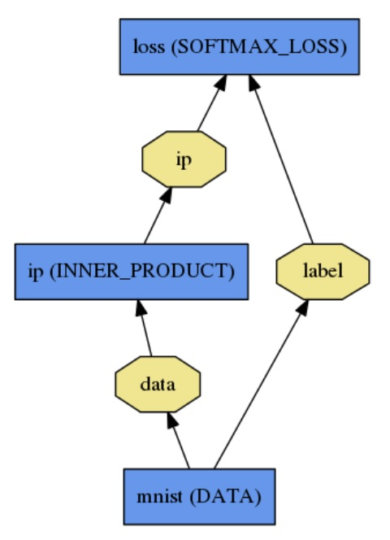

---
---
# Nets, Layers, and Blobs: anatomy of a Caffe model

Deep networks are compositional models that are naturally represented as a collection of inter-connected layers. Caffe defines a net layer-by-layer in its own model schema. The network defines the entire model bottom-to-top from input data to loss. As data and derivatives flow through the network in the [forward and backward passes](forward_backward.html) Caffe stores, communicates, and manipulates the information as *blobs*: the blob is the standard array and unified memory interface for the framework.

[Solving](solver.html) is configured separately to decouple modeling and optimization.

The layer comes first as the foundation of both model and computation. The net follows as the collection and connection of layers. The details of blob describe how information is stored and communicated in and across layers and nets.

## Layer computation and connections

The layer is the essence of a model and the fundamental unit of computation. Layers convolve filters, pool, take inner products, apply nonlinearities like rectified-linear and sigmoid and other elementwise transformations, normalize, load data, and compute losses like softmax and hinge. [See the layer catalogue](layers.html) for all operations. All the types needed for state-of-the-art deep learning tasks are there.

A layer takes input through *bottom* connections and makes output through *top* connections.

Each layer type defines three critical computations: *setup*, *forward*, and *backward*.

- Setup: initialize the layer and its connections once at model initialization.
- Forward: given input from bottom compute the output and send to the top.
- Backward: given the gradient w.r.t. the top output compute the gradient w.r.t. to the input and send to the bottom. A layer with parameters computes the gradient w.r.t. to its parameters and stores it internally.

Layers have two key responsibilities for the operation of the network as a whole: a *forward pass* that takes the inputs and produces the outputs, and a *backward pass* that takes the gradient with respect to the output, and computes the gradients with respect to the parameters and to the inputs, which are in turn back-propagated to earlier layers. These passes are simply the composition of each layer's forward and backward.

Developing custom layers requires minimal effort by the compositionality of the network and modularity of the code. Define the setup, forward, and backward for the layer and it is ready for inclusion in a net.

## Net definition and operation

The net jointly defines a function and its gradient by composition and auto-differentiation. The composition of every layer's output computes the function to do a given task, and the composition of every layer's backward computes the gradient from the loss to learn the task. Caffe models are end-to-end machine learning engines.

The net is a set of layers connected in a computation graph -- a DAG / directed acyclic graph to be exact. Caffe does all the bookkeeping for any DAG of layers to ensure correctness of the forward and backward passes. A typical net begins with a data layer that loads from disk and ends with a loss layer that computes the objective for a task such as classification or reconstruction.

The net is defined as a set of layers and their connections in a plaintext modeling language.
A simple logistic regression classifier

is defined by

    name: "LogReg"
    layers {
      name: "mnist"
      type: DATA
      top: "data"
      top: "label"
      data_param {
        source: "input_leveldb"
        batch_size: 64
      }
    }
    layers {
      name: "ip"
      type: INNER_PRODUCT
      bottom: "data"
      top: "ip"
      inner_product_param {
        num_output: 2
      }
    }
    layers {
      name: "loss"
      type: SOFTMAX_LOSS
      bottom: "ip"
      bottom: "label"
      top: "loss"
    }

The Net explains its initialization as it goes:

    I0902 22:52:17.931977 2079114000 net.cpp:39] Initializing net from parameters:
    name: "LogReg"
    [...model prototxt printout...]
    # construct the network layer-by-layer
    I0902 22:52:17.932152 2079114000 net.cpp:67] Creating Layer mnist
    I0902 22:52:17.932165 2079114000 net.cpp:356] mnist -> data
    I0902 22:52:17.932188 2079114000 net.cpp:356] mnist -> label
    I0902 22:52:17.932200 2079114000 net.cpp:96] Setting up mnist
    I0902 22:52:17.935807 2079114000 data_layer.cpp:135] Opening leveldb input_leveldb
    I0902 22:52:17.937155 2079114000 data_layer.cpp:195] output data size: 64,1,28,28
    I0902 22:52:17.938570 2079114000 net.cpp:103] Top shape: 64 1 28 28 (50176)
    I0902 22:52:17.938593 2079114000 net.cpp:103] Top shape: 64 1 1 1 (64)
    I0902 22:52:17.938611 2079114000 net.cpp:67] Creating Layer ip
    I0902 22:52:17.938617 2079114000 net.cpp:394] ip <- data
    I0902 22:52:17.939177 2079114000 net.cpp:356] ip -> ip
    I0902 22:52:17.939196 2079114000 net.cpp:96] Setting up ip
    I0902 22:52:17.940289 2079114000 net.cpp:103] Top shape: 64 2 1 1 (128)
    I0902 22:52:17.941270 2079114000 net.cpp:67] Creating Layer loss
    I0902 22:52:17.941305 2079114000 net.cpp:394] loss <- ip
    I0902 22:52:17.941314 2079114000 net.cpp:394] loss <- label
    I0902 22:52:17.941323 2079114000 net.cpp:356] loss -> loss
    # set up the loss and configure the backward pass
    I0902 22:52:17.941328 2079114000 net.cpp:96] Setting up loss
    I0902 22:52:17.941328 2079114000 net.cpp:103] Top shape: 1 1 1 1 (1)
    I0902 22:52:17.941329 2079114000 net.cpp:109]     with loss weight 1
    I0902 22:52:17.941779 2079114000 net.cpp:170] loss needs backward computation.
    I0902 22:52:17.941787 2079114000 net.cpp:170] ip needs backward computation.
    I0902 22:52:17.941794 2079114000 net.cpp:172] mnist does not need backward computation.
    # determine outputs
    I0902 22:52:17.941800 2079114000 net.cpp:208] This network produces output loss
    # finish initialization and report memory usage
    I0902 22:52:17.941810 2079114000 net.cpp:467] Collecting Learning Rate and Weight Decay.
    I0902 22:52:17.941818 2079114000 net.cpp:219] Network initialization done.
    I0902 22:52:17.941824 2079114000 net.cpp:220] Memory required for data: 201476

Model initialization is handled by `Net::Init()`.

The network is run on CPU or GPU by setting a single switch. Layers come with corresponding CPU and GPU routines that produce identical results (with tests to prove it). The CPU / GPU switch is seamless and independent of the model definition. For research and deployment alike it is best to divide model and implementation.

## Blob storage and communication

Caffe stores and communicates data in 4-dimensional arrays called blobs. Blobs provide a unified memory interface, holding data e.g. batches of images, model parameters, and derivatives for optimization.

Blobs conceal the computational and mental overhead of mixed CPU/GPU operation by synchronizing from the CPU host to the GPU device as needed. In practice, one loads data from the disk to a blob in CPU code, calls a device kernel to do GPU computation, and ferries the blob off to the next layer, ignoring low-level details while maintaining a high level of performance.

Memory on the host and device is allocated on demand (lazily) for efficient memory usage.

The conventional blob dimensions for data are number N x channel K x height H x width W. Blob memory is row-major in layout so the last / rightmost dimension changes fastest.

- Number / N is the batch size of the data. Batch processing achieves better throughput for communication and device processing. For an ImageNet training batch of 256 images B = 256.
- Channel / K is the feature dimension e.g. for RGB images K = 3.

Caffe operations are general with respect to the channel dimension / K. Grayscale and hyperspectral imagery are fine. Caffe can likewise model and process arbitrary vectors in blobs with singleton. That is, the shape of blob holding 1000 vectors of 16 feature dimensions is 1000 x 16 x 1 x 1.

Parameter blob dimensions vary according to the type and configuration of the layer. For a convolution layer with 96 filters of 11 x 11 spatial dimension and 3 inputs the blob is 96 x 3 x 11 x 11. For an inner product / fully-connected layer with 1000 output channels and 1024 input channels the parameter blob is 1 x 1 x 1000 x 4096.

For custom data it may be necessary to hack your own input preparation tool or data layer. However once your data is in your job is done. The modularity of layers accomplishes the rest of the work for you.

### Model format

The models are defined in plaintext protocol buffer schema (prototxt) while the learned models are serialized as binary protocol buffer (binaryproto) .caffemodel files.

The model format is defined by the protobuf schema in [caffe.proto](https://github.com/BVLC/caffe/blob/master/src/caffe/proto/caffe.proto).

Caffe speaks [Google Protocol Buffer](https://code.google.com/p/protobuf/) for the following strengths: minimal-size binary strings when serialized, efficient serialization, a human-readable text format compatible with the binary version, and efficient interface implementations in multiple languages, most notably C++ and Python. This all contributes to the flexibility and extensibility of modeling in Caffe.
