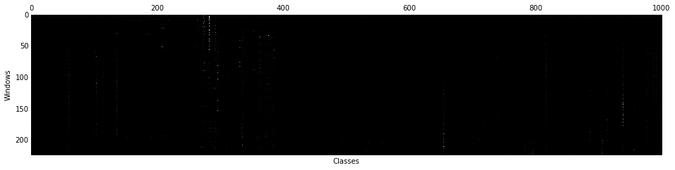
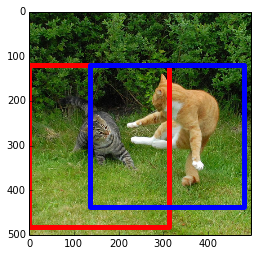
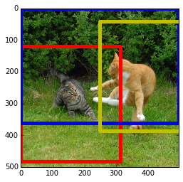

Running Windowed Detection with Caffe
=====================================

[View this page as an IPython Notebook](http://nbviewer.ipython.org/url/caffe.berkeleyvision.org/selective_search_demo.ipynb)

This approach follows ideas described in Ross Girshick, Jeff Donahue, Trevor Darrell, Jitendra Malik. *Rich feature hierarchies for accurate object detection and semantic segmentation*. [Arxiv 2013](http://arxiv.org/abs/1311.2524).

First of all, we'll need a little [Python
script](https://github.com/sergeyk/selective_search_ijcv_with_python) to run the
Matlab Selective Search code.

Let's run detection on an image of a couple of cats frolicking (one of the
ImageNet detection challenge pictures), which we will download from the web.
You'll need a prototxt specifying the network, and a trained model. We will use
`examples/imagenet_deploy.prototxt` and `alexnet_train_iter_470000` or
[caffe_reference_imagenet_model](https://www.dropbox.com/s/n3jups0gr7uj0dv/caffe_reference_imagenet_model):
you'll need to download the model for yourself! Note that
`caffe_reference_imagenet_model` may give slightly different results than this
example, which uses `alexnet_train_iter_470000`.

    wget http://farm1.static.flickr.com/220/512450093_7717fb8ce8.jpg
    echo `pwd`/"512450093_7717fb8ce8.jpg" > image_cat.txt
    python detector.py --input_file=image_cat.txt --crop_mode=selective_search --model_def=<path to imagenet_deploy.prototxt> --pretrained_model=<path to alexnet_train_iter_470000> --output_file=selective_cat.h5

Running this outputs an HDF5 file with the filenames, selected windows, and
their ImageNet scores.
Of course, we only ran on one image, so the filenames will all be the same.

In general, `detector` is most efficient when running on a lot of images: it
first extracts window proposals for all of them, batches the windows for
efficient GPU processing, and then outputs the results. Simply list an image per
line in the `images_file`, and `detector` will process all of them.

Although this guide gives an example of ImageNet detection, `detector` is clever
enough to adapt to different Caffe models’ input dimensions, batch size, and
output categories. Refer to `python detector.py --help` and the `images_dim` and
`images_mean_file` parameters to describe your data set. No need for hardcoding.

Further crop modes are supported too, including a `--crop_mode=list` for
predefined list of images and windows given as an input CSV. For now, refer to
the source.

    import pandas as pd

    df = pd.read_hdf('images_feats_selective_cat.h5', 'df')
    print(df)
    print('')
    print(df.iloc[0])

    <class 'pandas.core.frame.DataFrame'>
    Int64Index: 223 entries, 0 to 222
    Data columns (total 3 columns):
    filename    223  non-null values
    window      223  non-null values
    feat        223  non-null values
    dtypes: object(3)

    filename    /home/sergeyk/work/caffe/512450093_7717fb8ce8.jpg
    window                                       [0, 0, 500, 496]
    feat        [4.35792e-06, 9.655e-07, 1.70705e-06, 1.10006e...
    Name: 0, dtype: object

Load ImageNet class names and make a DataFrame of features.

    with open('../../../examples/synset_words.txt') as f:
        labels = [' '.join(l.strip().split(' ')[1:]).split(',')[0] for l in f.readlines()]
    feats_df = pd.DataFrame(np.vstack(df.feat.values), columns=labels)
    feats_df

<pre>
&lt;class 'pandas.core.frame.DataFrame'&gt;
Int64Index: 223 entries, 0 to 222
Columns: 1000 entries, tench to toilet tissue
dtypes: float32(1000)
</pre>

Let's look at the activations.

    gray()
    matshow(feats_df.values)
    xlabel('Classes')
    ylabel('Windows')

Now let's take max across all windows and plot the top classes.

    max_s = feats_df.max(0)
    max_s.sort(ascending=False)
    print(max_s[:10])

    tiger cat              0.927175
    proboscis monkey       0.889266
    milk can               0.803475
    American black bear    0.725793
    broccoli               0.603212
    platypus               0.548122
    lion                   0.542445
    golden retriever       0.535931
    wood rabbit            0.488956
    dhole                  0.456717
    dtype: float32

Okay, there are indeed cats in there. Let's see what the top detection and the
10th top detection are.

    # Find, print, and display max detection.
    window_order = pd.Series(feats_df.values.max(1)).order(ascending=False)

    i = window_order.index[0]
    j = window_order.index[10]

    # Show top predictions for top detection.
    f = pd.Series(df['feat'].iloc[i], index=labels)
    print('Top detection:')
    print(f.order(ascending=False)[:5])
    print('')

    # Show top predictions for 10th top detection.
    f = pd.Series(df['feat'].iloc[j], index=labels)
    print('10th detection:')
    print(f.order(ascending=False)[:5])

    # Show top detection in red, 10th top detection in blue.
    im = imread('512450093_7717fb8ce8.jpg')
    imshow(im)
    currentAxis = plt.gca()
    window = df.iloc[i]['window']
    coords = (window[1], window[0]), window[3], window[2]
    currentAxis.add_patch(Rectangle(*coords, fill=False, edgecolor='r', linewidth=5))

    window = df.iloc[j]['window']
    coords = (window[1], window[0]), window[3], window[2]
    currentAxis.add_patch(Rectangle(*coords, fill=False, edgecolor='b', linewidth=5))

    Top detection:
    tiger cat       0.927175
    tabby           0.039722
    tiger           0.027441
    lynx            0.004363
    Egyptian cat    0.000862
    dtype: float32

    10th detection:
    tiger cat           0.790947
    dhole               0.068737
    red fox             0.028559
    proboscis monkey    0.020050
    tiger               0.016998
    dtype: float32

That's cool. Both of these detections are tiger cats. Let's take all 'tiger cat'
detections and NMS them to get rid of overlapping windows.

    def nms_detections(windows, overlap=0.5):
            """
            Non-maximum suppression: Greedily select high-scoring detections and skip
            detections that are significantly covered by a previously selected detection.

            This version is translated from Matlab code by Tomasz Malisiewicz,
            who sped up Pedro Felzenszwalb's code.

            Input:
                dets: ndarray where each row is ['x', 'y', 'w', 'h', 'score']
                overlap: float for the minimum overlap ratio (0.5 default)

            Output:
                dets that remain after suppression.
            """
            if np.shape(dets)[0] < 1:
                return dets

            x1 = dets[:, 1]
            y1 = dets[:, 0]

            w = dets[:, 3]
            h = dets[:, 2]
            x2 = w + x1 - 1
            y2 = h + y1 - 1
            area = w * h

            s = dets[:, 4]
            ind = np.argsort(s)

            pick = []
            counter = 0
            while len(ind) > 0:
                last = len(ind) - 1
                i = ind[last]
                pick.append(i)
                counter += 1

                xx1 = np.maximum(x1[i], x1[ind[:last]])
                yy1 = np.maximum(y1[i], y1[ind[:last]])
                xx2 = np.minimum(x2[i], x2[ind[:last]])
                yy2 = np.minimum(y2[i], y2[ind[:last]])

                w = np.maximum(0., xx2 - xx1 + 1)
                h = np.maximum(0., yy2 - yy1 + 1)

                o = w * h / area[ind[:last]]

                to_delete = np.concatenate(
                    (np.nonzero(o > overlap)[0], np.array([last])))
                ind = np.delete(ind, to_delete)

            return dets[pick, :]

    scores = feats_df['tiger cat']
    windows = np.vstack(df['window'].values)
    dets = np.hstack((windows, scores))
    nms_dets = nms_detections(dets)

Show top 3 NMS'd detections for 'tiger cat' in the image.

    im = imread('512450093_7717fb8ce8.jpg')
    imshow(im)
    currentAxis = plt.gca()
    colors = ['r', 'b', 'y']
    for c, det in zip(colors, nms_dets[:3]):
        currentAxis.add_patch(Rectangle((det[1], det[0]), det[3], det[2], fill=False, edgecolor=c, linewidth=5))

