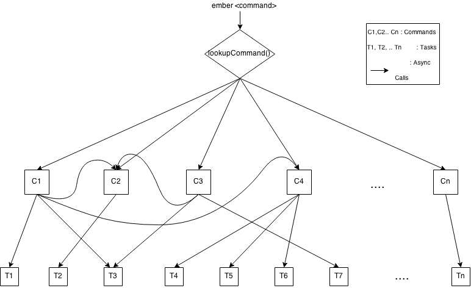

## Architecture



## Overview
- **cli** parses args and calls the respective **command**
- **command** calls a sequence of **tasks**
- **tasks** do the actual work

## The different components of ember-cli
### cli()
cli is a small function that gets everything going.

Usage:
``` JavaScript
var cli = require('./cli');

cli({
  cliArgs: argv, // Required
  inputStream: inputStream, // Required
  outputStream: outputStream // Required
})
.then(...);
```

## UI
In ember-cli we pass an `UI` instance around. Instead of calling
`console.log` or writing things directly to `process.stdout` we access
those through this wrapper. This makes our code testing friendly
because it lets us simulate user input and it lets us verify if the output
matches the expected output in tests.

`ui.prompt(options).then(...)` can be used to get user input. It wraps the [inquirer node
package](https://github.com/SBoudrias/Inquirer.js). See its documentation for
usage instructions. Note: Navigation with
arrow keys doesn't work properly on windows, only use prompt types with
text input.

`ui.write()` can be used to write something to the output stream. It's just
`this.outputStream.write(data);` internally.

`ui.inputStream`, `ui.outputStream` can be used for things that require a
stream. Also nice for testing, e.g. simulating input.

### Commands
Located in `lib/commands/`. They get picked up by `requireAsHash()`
automatically.

The CLI constructs command instances with dependencies including ui,
analytics, commands, project, etc. The plan is for these to eventually
be constructed and wired up via a dependency injection container.

The following file structure is expected (Demonstrated on the imaginary
command `develop-ember-cli`):

``` JavaScript
// e.g. commands/develop-ember-cli.js

var Command = require('../models/command');

module.exports = Command.extend({
  name: 'develop-ember-cli',    // Optional, default is the filename
                                // Powered by some magic in getCallerFile()
  key: 'developEmberCLI',       // Optional, default is the camelized name
  description: 'Explanation',   // Optional
  aliases: ['d', 'go-tomster'], // Optional, default is an empty array
  works: 'everywhere',          // 'insideProject', 'outsideProject' or 'everywhere'
                                // Optional, default is 'insideProject'

  availableOptions: [           // Optional, default is an empty array
    {
      name: 'package-name',     // Required
      key: 'packageName'        // Optional, default is the camelized name
      description: '...',       // Optional
      type: String,             // Required
      default: 'ember-cli',     // Optional, default is undefined
      required: false           // Optional, default is false
    },
    ...
  ],

  anonymousOptions: [
    '<option-1>',
    '<option-2>',
    ...
  ],

  run: function(options) { // Required
    // options === { packageName, ... }

    // Run tasks and return a promise
  },

  printDetailedHelp: function() { // Optional
    this.ui.write('Detailed help...');
  }
});
```

For more information on possible option types, see the [documentation for the
nopt library](https://github.com/npm/nopt).

Best practice is to use the `run()` function only to execute tasks. The real
work should be done in these tasks, then.

The promise returned by `run()` should either

- resolve to `undefined`
- reject with an `Error` instance if the error is unhandled
- or reject with `undefined` if it was handled. In this case the command
should log something via the `ui` first.

`requireAsHash()` assembles from the files in `commands/` a hash that looks
like this:

``` JavaScript
{
  DevelopEmberCLI: require('commands/develop-ember-cli'),
  ...
}
```

#### Usage instructions formatting
```
ember serve <arg-option (Default: something)>
  --port (Default: 4200) Description 1
  --important-option (Required) Description 2
```

##### Formatting colors
- white: `ember serve`
- yellow: `<arg-option `, `>`
- cyan: `--port`, `--important-option`
- cyan: `(Default: something)`, `(Default: 4200)`
- white: `Description 1`, `Description 2`
- cyan: `(Required)`

### Tasks
Located in `lib/tasks`. They get picked up by `requireAsHash()` automatically.

Tasks do the real work. They should also do only one thing: For example there
are separate `bower-install` and `npm-install` tasks, not just one unified
`install` task. And they should not call other tasks: For example
`install-blueprint` shouldn't call `npm-install` directly. That's because the
task sequence is determined by the command and thus should be declared there.

The command constructs task instances with dependencies including ui,
analytics, project, etc. The plan is for these to eventually
be constructed and wired up via a dependency injection container.

A task's `run` method has to return a promise which resolves or rejects
depending on whether it ran through successfully or not.

The promise of a task should either
- fulfill to `undefined`
- reject with an `Error` instance if the error is unhandled
- or reject with `undefined` if it was handled. In this case the task should
log something via the `ui` first.

So, tasks don't have a return value per design.

The file format of a task looks like this:
``` JavaScript
// tasks/npm-install.js

var Task = require('../task');

module.exports = Task.extend({
  run: function(options) {
    // return promise
  }
});
```

`requireAsHash()` assembles from the files in `tasks/` a hash that looks like this:
``` JavaScript
{
  NpmInstall: require('tasks/npm-install'),
  ...
}
```

## Style guide
- Everything Promise based ( use: lib/ext/promise)
- Everything async (except require)
- Short files
- Tests, tests, tests
- Recommended line length <= 80 characters
- No `console.log`, we've our own logging system
- HTML and CSS: Double quotes, JavaScript: Single quotes
- Naming conventions
  - Dasherized (`some-thing`)
    - file, folder and package names
    - CSS classes
    - HTML tags and attributes
    - Model relationships
  - Camel case (`someThing`)
    - JavaScript (and JSON) properties and variables
  - Pascal case (`SomeThing`)
    - JavaScript class names
  - Acronyms:
    - Okay: `url`, `id`, `rootURL` (property) or `URL`, `URLParser` (class)
    - Wrong: `Url`,`rootUrl`
    - We stick with how it's done in ember -> `rootURL`
- No comma separated var statements (`var cool = 123, supercool = 456;`)
- Line break at the end of every file
- Make constructors take an options object to avoid order-dependence

This list only contains style decisions not already covered by JSHint (e.g.
mandatory semicolons and other rules are omitted).

### Indentation
#### Aligned require statements
``` JavaScript
var RSVP    = require('rsvp');
var Promise = RSVP.Promise;
```

#### Multi-line return statement
``` JavaScript
// Correct
return someFunction(
    someArgument,
    otherArgument
  );

// Wrong
return someFunction(
  someArgument,
  otherArgument
);
```

``` JavaScript
// Correct
return returnsAPromise()
  .then(...)
  .catch(...);

// Wrong
return retursAPromise().then(...)
.catch(...);
```

### Custom errors
Custom error classes should end with the suffix "Error".

``` JavaScript
function CustomError() {
  this.stack = (new Error()).stack;
}

CustomError.prototype = Object.create(Error.prototype);
CustomError.prototype.name = 'CustomError';
```

Also a `message` property should be set: Either in the constructor or as a property on `CustomError.prototype`.


### Dependencies
When requiring modules, we should be aware of their effect on startup
time. If they introduce a noticeable penalty, and are not needed except
for some task/command we should require them lazily. Obviously a few
small modules wont make a difference, but eagerly requiring npm + bower
and all of lodash will add a second to startup time.

The following example eagerly requires npm, but only truly requires it
when that task is invoked, not for `ember help` `ember version` or even
`ember server`. This introduces a 200ms-300ms startup penalty.

```js
var npm = require('npm');

module.exports = Task.extend({
  run: function() {
    npm.install() // or something
  }
});
```

If a dependency (like bower or npm) turns out to have high startup cost,
we should require them lazily. This also allows us to inject
alternative dependencies at construction time. Some future DI
refactoring can likely automate this process.

example:

```js
module.exports = Task.extend({
  init: function() {
    this.npm = this.npm || require('npm');
  },
  run: function() {
    this.npm.install() // or something
  }
});
```

### Sync vs async
Since [JavaScript uses an event loop](http://nodejs.org/about/), the use of
blocking and compute intensive operations is discouraged. The general
recommendation is to use asynchronous operations.

However, there are exceptions. Node's own `require` statement is synchronous. It
is mainly used at program startup and only for a handful of files. Consequently,
although it being synchronous, using it is harmless. Same thing goes for
synchronous file globs in combination with `require` at startup.

The use of asynchronous code is mainly important for file walking operations
during runtime. For example for globbing a large amount of files or recursive
copying/deleting of folder structures. These operations generally take a long
time to complete and would if implemented synchronously disrupt progress
animations or delay server responses.

An advantage of asynchronous operations is that libraries can use it to
offer increased reliability. For example the popular file deletion library
rimraf uses `setTimeout` and a limited amount of retries after increasing
time intervals to [mitigate EBUSY errors on
windows](https://github.com/isaacs/rimraf/blob/master/rimraf.js#L20-L27).
Also, libraries can use asynchronicity to offload work onto worker threads. By
providing an asynchronous API, fixes and optimizations can be implemented
transparently without breaking API compatibility.
